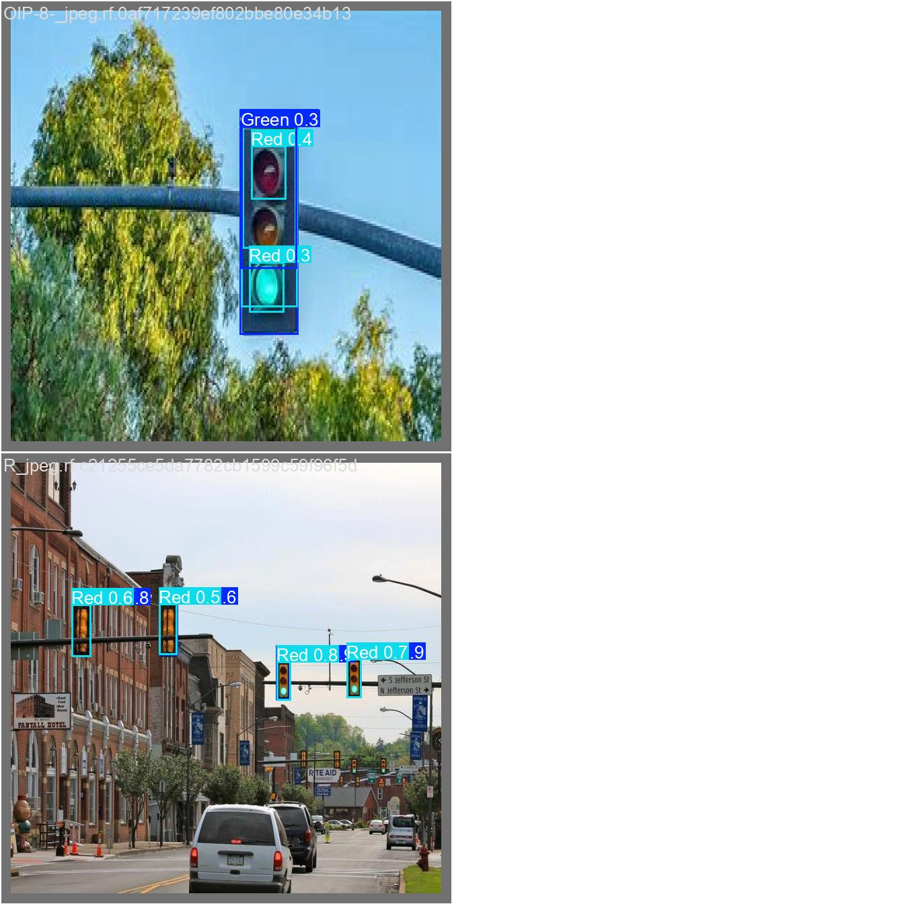
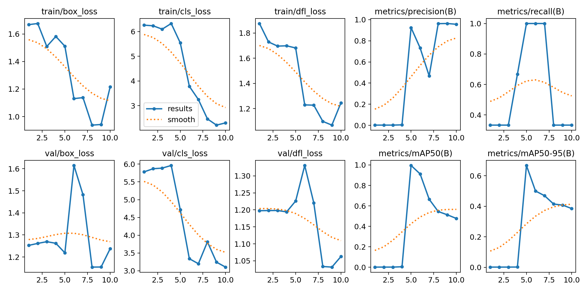
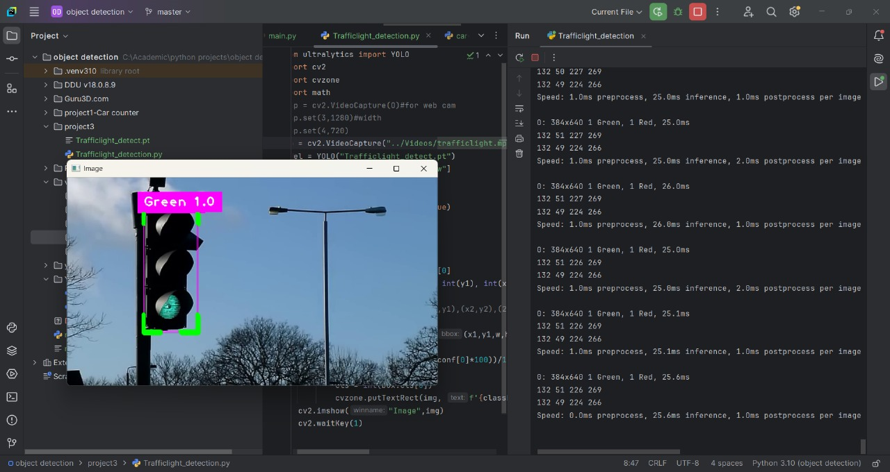
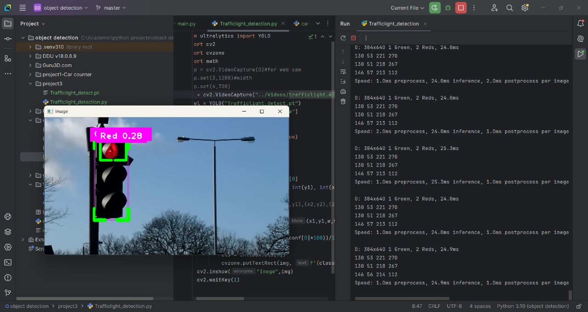

# 🚦 Traffic Light Detector — YOLOv8

A machine learning project to **detect traffic lights and classify their colors** (red, yellow, green) using a custom-trained YOLOv8 model.

This project:
✅ Uses a **custom dataset**  
✅ Was **trained on Google Colab**  
✅ Runs locally on **PyCharm**  
✅ Supports external GPU to accelerate inference and reduce runtime

---

## 📸 Demo Images

Here’s a glimpse of the project in action:

<table>
  <tr>
    <td></td>
    <td></td>
  </tr>
  <tr>
    <td align="center">Training model</td>
    <td align="center">mAP Curve during Training</td>
  </tr>
</table>

<table>
  <tr>
    <td></td>
    <td></td>
  </tr>
  <tr>
    <td align="center">Detection Example 1</td>
    <td align="center">Detection Example 2</td>
  </tr>
</table>


---

## 🚀 Project Workflow

### 1. Data Collection & Annotation

- Images of traffic lights captured from streets and public datasets.
- Classes labeled:
  - red_light
  - green_light
  - yellow_light

Annotations created using **Roboflow** and exported in YOLOv8 format.

---

### 2. Model Training (Google Colab)

The model was trained in Google Colab using:

```bash
yolo detect train model=yolov8l.pt \
    data=/content/traffic-lights/data.yaml \
    epochs=50 imgsz=640
